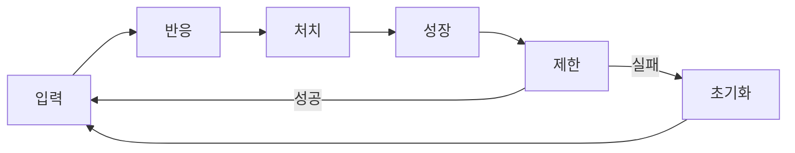

# ⚔️ Work Warrior (DeskWarrior) - Game Design Document

> **Version**: 1.0  
> **Last Updated**: 2026-01-11  
> **Status**: Planning Phase

---

## 1. 컨셉 (Concept)

**"일(Typing)을 열심히 했더니, 어느새 용사가 세상을 구했다."**

Bongo Cat 밈의 반응형 비주얼과 클리커/로그라이크 RPG의 성장 요소를 결합한 **데스크탑 액세서리 게임**.

사용자의 키보드/마우스 입력을 게임의 '공격'으로 치환하여, **업무 효율과 시각적 즐거움**을 동시에 추구합니다.

---

## 2. 목표 (Goals)

| 목표 | 설명 |
|------|------|
| **No Stress** | 게임을 위해 업무를 방해받지 않음 |
| **Visual Feedback** | 타건과 함께 캐릭터 반응으로 타격감 제공 |
| **Data Logging** | 입력량 데이터화로 성취감 부여 |

---

## 3. 핵심 게임 루프 (Core Loop)

1. **입력 (Input)**: 키보드/마우스 입력
2. **반응 (Action)**: 캐릭터가 무기 휘두름 + 몬스터 피격 흔들림
3. **처치 (Kill)**: HP 0 → 골드 획득 → 즉시 리스폰
4. **성장 (Upgrade)**: 골드로 공격력 강화
5. **제한 (Limit)**: 제한 시간 내 처치 실패 시 초기화

---

## 4. 전투 및 연출 (Combat & Visuals)

### 4.1 공격 판정
- **1 Input = 1 Damage** (기본 공격력 적용)
- Global Hook으로 모든 키보드/마우스 이벤트 캡처

### 4.2 타격감 (The Juice)
- 입력 시 몬스터 이미지 **랜덤 흔들림** (-2px ~ +2px)
- 연타 시 **진동 누적** 효과
- 사운드 및 시각적 피드백

### 4.3 리스폰
- **딜레이 0초**: 처치 이펙트와 동시에 다음 몬스터 등장
- 흐름 끊김 없이 지속적 전투

---

## 5. 레벨 디자인 (Level Design)

### 5.1 일반 몬스터
- 레벨업 시 HP **선형 증가**
- 공식: `HP = base_hp + (level - 1) * hp_growth`

### 5.2 보스 몬스터
| 속성 | 값 |
|------|-----|
| 등장 | 매 10레벨마다 |
| HP | 일반의 3배 |
| 크기 | 일반의 1.5배 |
| 역할 | 집중력 테스트 |

---

## 6. 로그라이크 시스템 (Roguelike Rules)

### 6.1 타임 어택
- 몬스터 등장 시 **타이머 시작** (기본 30초)
- 시간 내 처치 → 골드 획득, 다음 레벨
- 시간 초과 → **하드 리셋**

### 6.2 하드 리셋 (Hard Reset)
| 항목 | 리셋 값 |
|------|---------|
| 레벨 | → 1 |
| 골드 | → 0 |
| 업그레이드 | → 0 |

> 💡 **의도**: "잠깐 쉬었구나? 다시 몸 풀면서 올라와!"  
> 벌칙이 아닌 **휴식의 결과**로 포지셔닝

---

## 7. 개발 로드맵 (Roadmap)

### Phase 1: 프로토타입
- [ ] 투명 윈도우 + Topmost 설정
- [ ] Global Key Hook 연동
- [ ] 기본 이미지 배치 및 교체 테스트

### Phase 2: 코어 로직
- [ ] GameData.json 파싱
- [ ] HP, 데미지, 타이머 로직
- [ ] 타격 흔들림(Shake) 구현

### Phase 3: 폴리시
- [ ] 로컬 저장소 (Save/Load)
- [ ] UI 오버레이 (HP바, 타이머, 골드)
- [ ] Firebase 랭킹 시스템

---

## 8. 핵심 원칙

> **"닭 잡는데 소 잡는 칼을 쓰지 않는다."**

이 프로젝트의 핵심은 **가벼움**입니다:
- Unity 대신 **WPF** 선택
- 항상 켜두어도 부담 없는 **'생산성 도구 겸 장난감'**
- 불필요한 리소스 로딩 최소화
